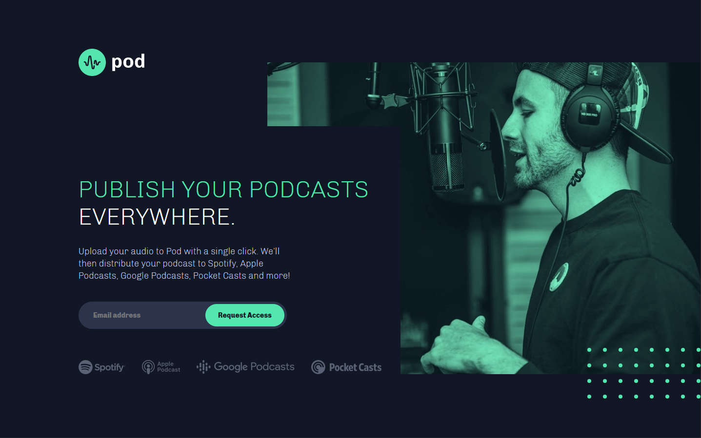

### Screenshot

### Links

- Solution URL: [Add solution URL here](https://www.frontendmentor.io/solutions/css-html-js-AC0ZbK-Xz)
- Live Site URL: [Add live site URL here](https://lonelybuddy.github.io/POD-lanind-page/)

### Built with

- Semantic HTML5 markup
- CSS custom properties
- Flexbox
- Mobile-first workflow

### Continued development

Yeah!!!! I finally got out of tutorial purgatory!
This is my first time doing project alone without following tutorial.
I am amazed that how much I have learned by doing this challenge.
I still remember every problem that I ran into, but I managed to fix it, very sloooowly...

## Author

- Website - [Henry Zheng](https://lonelybuddy.github.io/POD-lanind-page/)
- Frontend Mentor - [Henry Zheng](https://www.frontendmentor.io/profile/LonelyBuddy)
